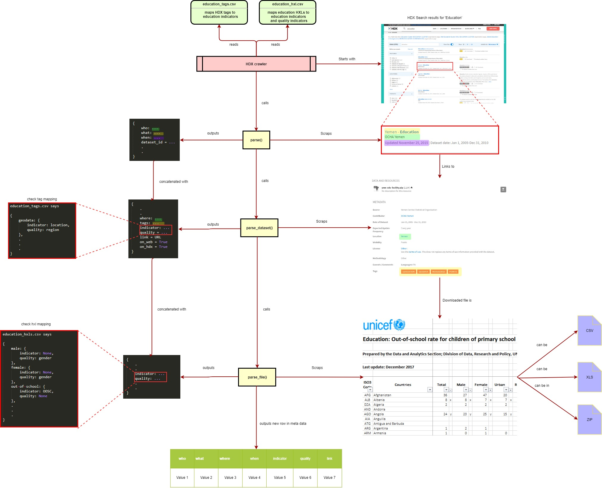

# HDX crawler

The purpose of this project is to present a proof of concept for the Education Meta-dataset on the [HDX Platform](https://data.humdata.org/). The project implements a crawler that takes education datasets as an input, and outputs a populated meta dataset. The crawler generates the input by scraping HTML/CSS elements from [HDX search results page for 'Education'](https://data.humdata.org/search?q=education). The crawler goes through each search result, dataset page, and the dataset itself to collect the data. The concept behind the metadataset and the details of the scraping algorithm is explained in section [Concept](#concept), and [Algorithm](#algorithm). The caveats and assumptions of the crawler are mentioned in the [Assumptions section](#assumptions)

## How to Run
### Python libraries

Assuming you're running on Python3, you need to have the following libraries installed before running
1. Scrapy
2. Pandas
3. Numpy

### Command line
1. cd to /tutorial/spiders folder
2. scrapy crawl hdx

## Concept

Takes architicture of a Star Schema

"An approach to answering multi-dimensional analytical queries swiftly in computing"


A populated row in the meta-dataset would look as follows:

```Python
{
    # dataset dimension
    dataset_id: ...
    who: ...
    what: ...
    when: ...
    where: ...
    on_web: ...
    on_hdx: ...
    open_data: ...
    link: ...

    # tag dimension
    tag_id: ...
    tag: ...

    # hxl dimension
    hxl_id: ...
    hxl: ...

    # indicator dimension
    indicator_id: ...
    indicator: ...

    # quality dimension
    quality_id: ...
    quality: ...
}
```

### Populating the metadataset

The below figure shows the workflow of the crawler to populate a single row in the metadaset



Once the code has finished, two output files will be created, /tutorial/spiders/meta_data_test.json, and /tutorial/spiders/meta_data_test.csv, you may use either for your convenience. 
```diff 
- Remember to delete both files before running the code, otherwise the crawler will append to those files
```

### Algorithm

1. HDX Crawler starts at http
2. 

This section states the algorithm steps for populating the metadataset

## Assumptions

Three assumptions are mentioned below
1. CSS/HTML
2. Mappings
3. File type

### CSS/HTML

The crawler assumes that the HDX platform https://data.humdata.org/ has the same HTML and CSS as of 23 July 2018 

The crawler uses education indicators retrieved by performing Secondary Data Review of the official Indicator Registry Education Indicators https://ir.hpc.tools/. The reason is that most datasets and reports do not go to the level of details of the official education indicators. The Secondary Data Review reduces the indicators from 50 to 25. For more details, see FILE for description of each indicator and its link to registry code

education indicators are synchronized with the files opened. meaning that any indicator found within, should exist within education_indcators_description.csv

### Mappings
One-to-Many

### File type
Only considers css/xls/xlsx/zip

## Scalability

list
edit csv files to include more hxl
example: new education hxl given

## Output

.json
.csv

## User cases

Leveraging the metadataset. See .ipynyb

## Future work

1. Switch from scraping to using the HDX API to get the metadata
2. Use the Data Freshness database instead of the updated date to populate the time dimensions
3. Schedule Scrapy to run frequently by either using crontab command or deploying the spider to Scrapyd https://github.com/scrapy/scrapyd
4. Scrape data outside HDX such as Humanitarian Response Planning (HRP) and Humanitarian Needs Overview (HNO) PDFs
 

value of indicator
sector dimension
contact dimension
ad
